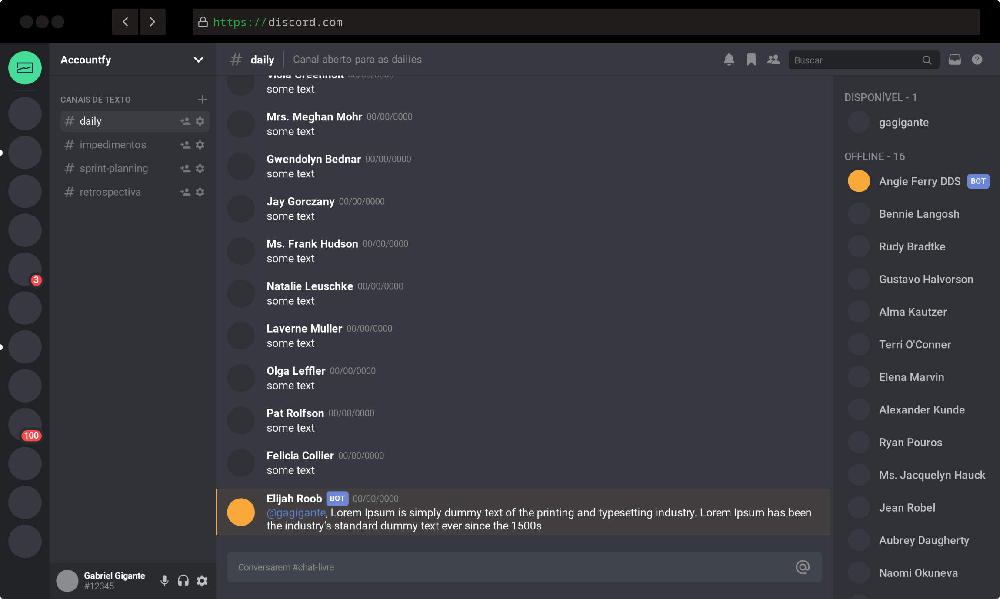

<h1 align="center">
  
  <br>
  Discord UI clone
</h1>

<p align="center">
  <a href="https://relaxed-tereshkova-430f40.netlify.app/" style="text-decoration: none">
    
  </a>

  

  
  
  <a href="https://github.com/gagigante/Discord-UI-Clone/commits/master" style="text-decoration: none">
    
  </a>

  <a href="https://github.com/gagigante/Discord-UI-Clone/issues" style="text-decoration: none">
    
  </a>

  
</p>

<p align="center">
  <a href="#rocket-technologies">Technologies</a>&nbsp;&nbsp;&nbsp;|&nbsp;&nbsp;&nbsp;
  <a href="#runner-how-to-run">How to run</a>&nbsp;&nbsp;&nbsp;|&nbsp;&nbsp;&nbsp;
  <a href="#-project">Project</a>&nbsp;&nbsp;&nbsp;|&nbsp;&nbsp;&nbsp;
  <a href="#-how-to-contribute">How to contribute</a>&nbsp;&nbsp;&nbsp;|&nbsp;&nbsp;&nbsp;
  <a href="#memo-license">License</a>
</p>

<br>

<p align="center">
  
</p>


## :rocket: Technologies

This project was developed with the following techs:

- [React](https://reactjs.org/)
- [Typescript](https://www.typescriptlang.org/)
- [Styled Components](https://styled-components.com/)

## :computer: Project

This project is a Discord based UI clone

## :runner: How to run

Install dependencies
```
  $ yarn

  or

  $ npm install
```

Start server
```
  $ yarn start

  or

  $ npm start
```

To build the app
```
  $ yarn build
```

## :thinking: How to contribute

- Fork this repo;
- Create a branch for your new feature: `git checkout -b my-feature`;
- Commit your changes: `git commit -m 'feat: My brand new feature'`;
- Push it to your branch: `git push origin my-feature`.

After merge of your pull request, you can delete your branch.

## :memo: License

This project is under MIT license. See the file [LICENSE](LICENSE) for details.

---
